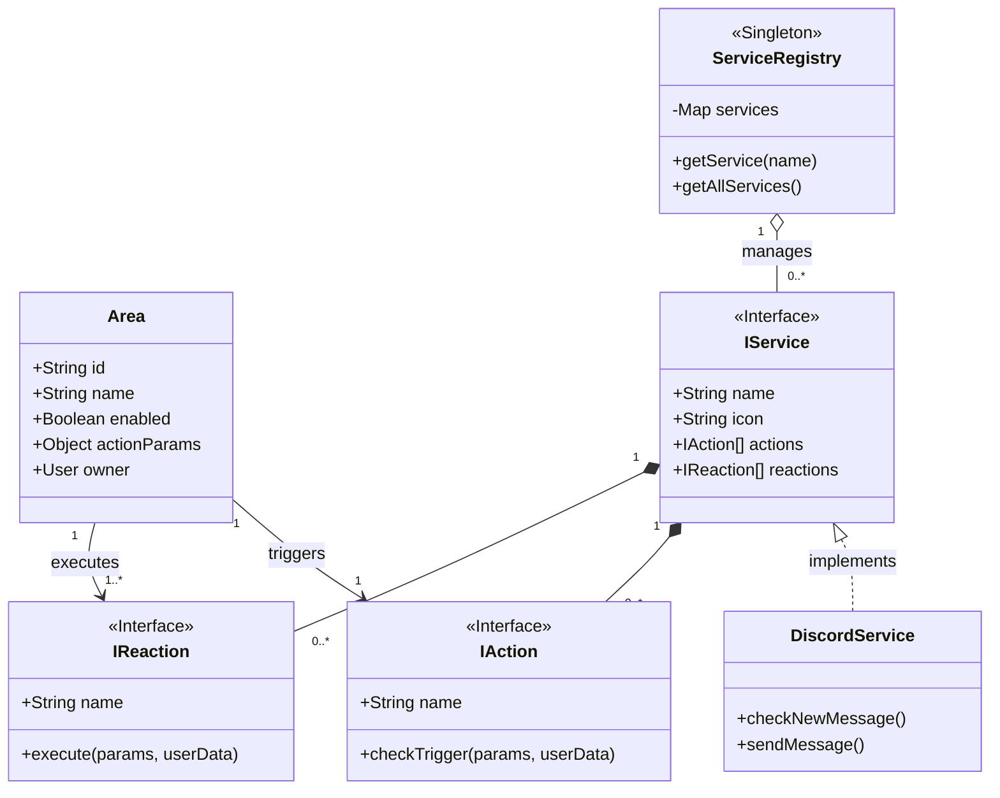
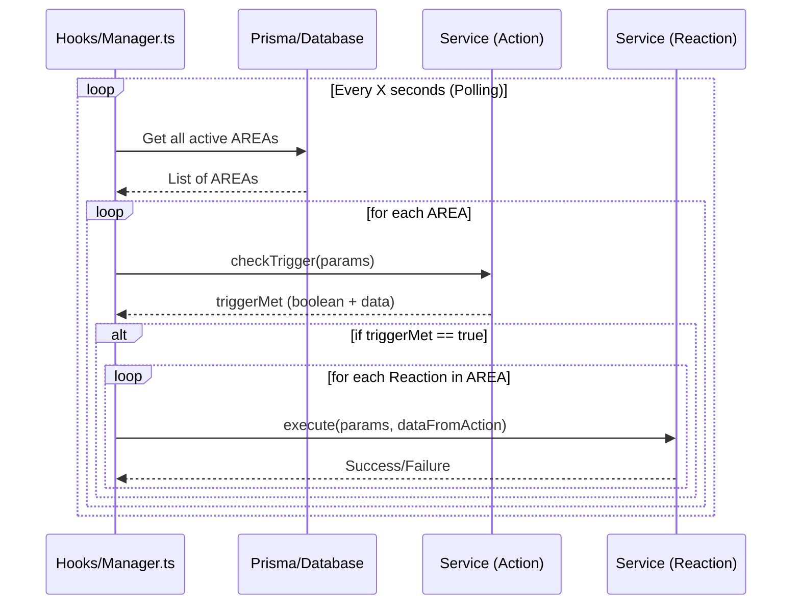
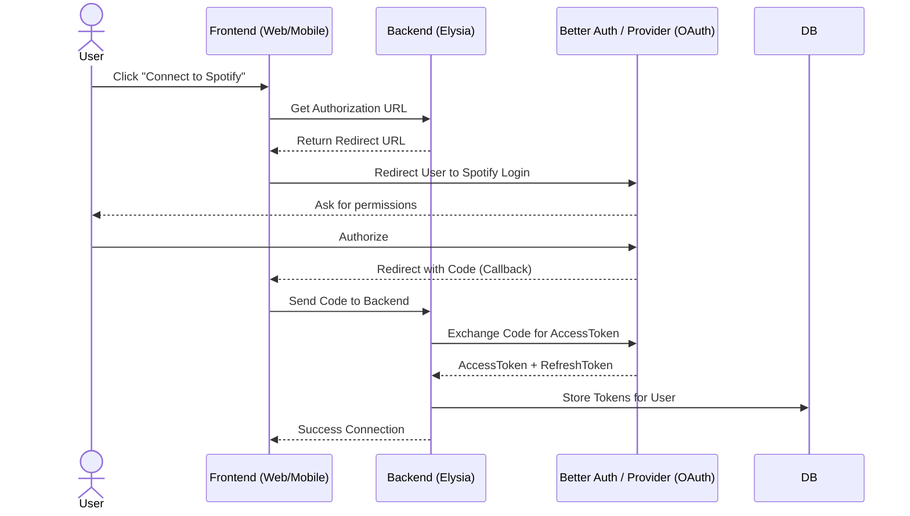
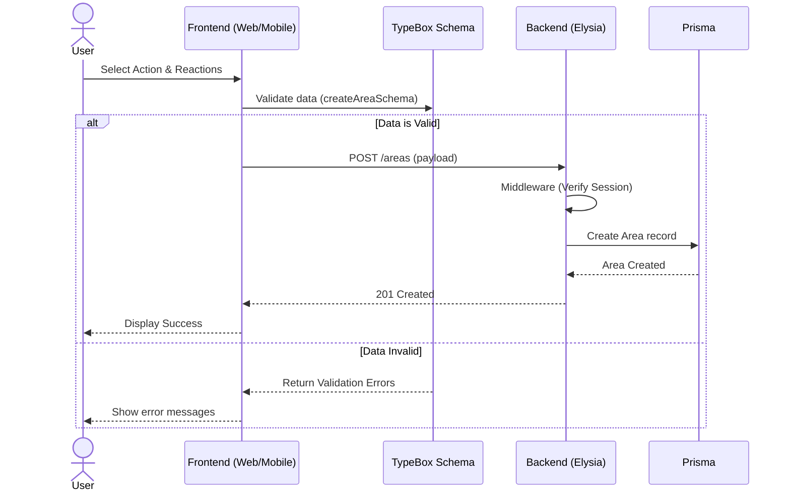

# Bienvenue sur la Documentation Technique du Projet AREA

Ce site contient la documentation technique complète pour le projet **AREA (Action-REAction)**, une plateforme d'automatisation inspirée par des services comme IFTTT et Zapier.

## Objectif du Projet

L'objectif est de permettre aux utilisateurs de connecter différents services (GitHub, Gmail, Spotify, etc.) en créant des **AREA**s. Chaque AREA est composée de :

- **Une Action :** Un déclencheur provenant d'un service (ex: "Un nouveau ticket Jira est créé" ou "Une nouvelle musique est likée sur Spotify").
- **Une Réaction :** Une conséquence exécutée sur un autre service (ex: "Envoyer un message sur Discord").

## Architecture Globale

Le projet est structuré en **monorepo** géré par **Bun Workspaces** et se divise en quatre composants principaux :

1.  **Serveur Backend (`apps/backend`)**:
    - API REST développée avec **ElysiaJS**.
    - Gère la logique métier, l'authentification, les connexions aux services et le moteur d'exécution (Polling).
    - Base de données **PostgreSQL** gérée via **Prisma**.

2.  **Client Web (`apps/web`)**:
    - Interface utilisateur développée avec **SvelteKit** et **TailwindCSS**.
    - Dispose d'un éditeur de flux visuel (Node Editor) pour créer des automatisations.

3.  **Client Mobile (`apps/mobile`)**:
    - Application native développée avec **React Native (Expo)** et **NativeWind**.
    - Propose un assistant de création interactif et animé.

4.  **Package Partagé (`packages/types`)**:
    - Contient les définitions de types TypeScript partagées (DTOs, Schémas TypeBox) entre le backend et les clients pour garantir la cohérence des données.

## Diagramme de Classes

## Diagramme de Séquence

## Diagramme de Séquence (OAuth)

## Diagramme de Création d'une AREA

Cette documentation est divisée en sections correspondant à chaque composant pour faciliter la navigation et la compréhension.
