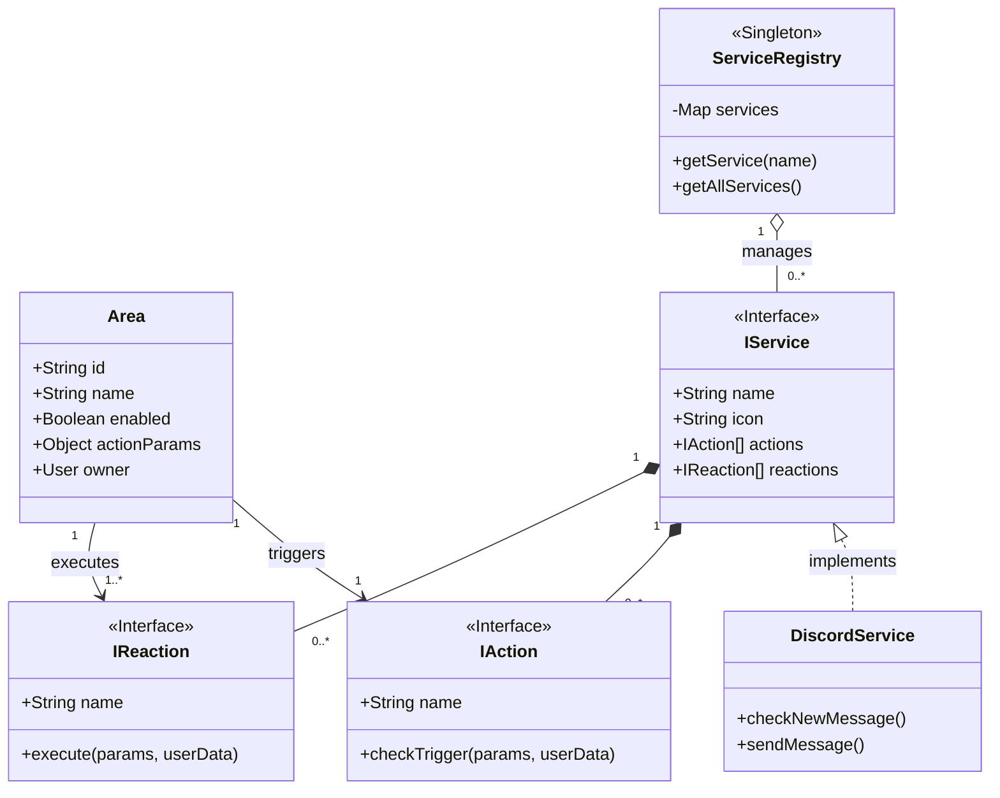
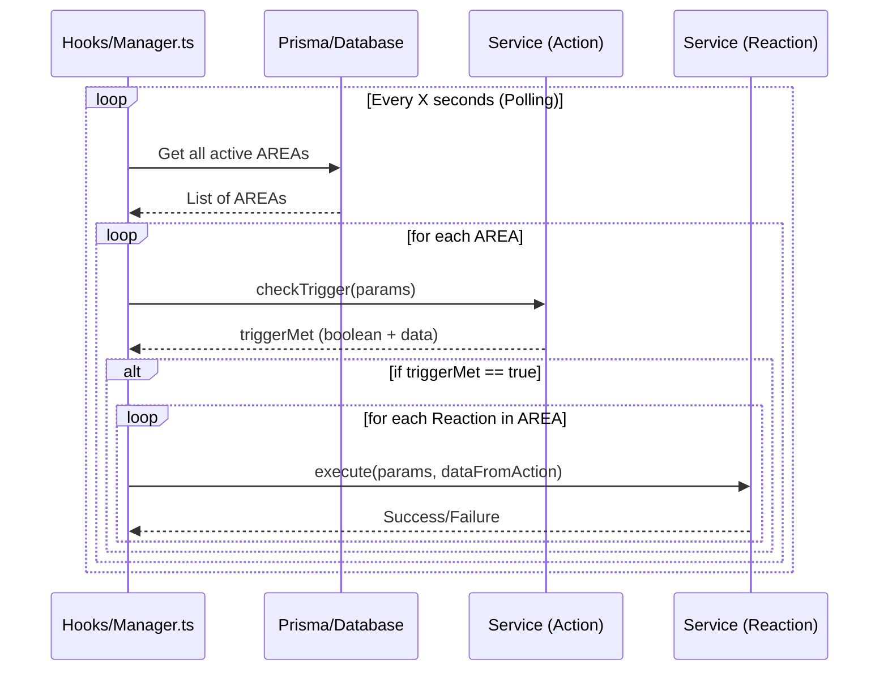
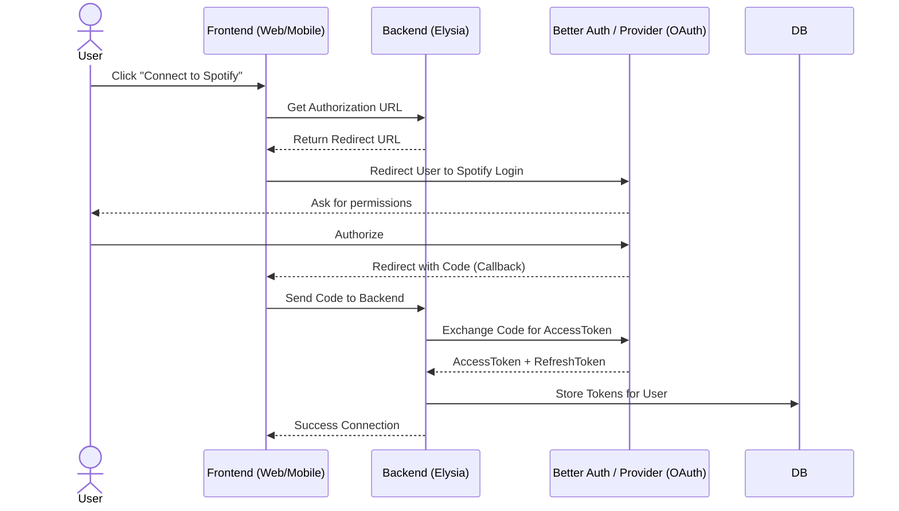
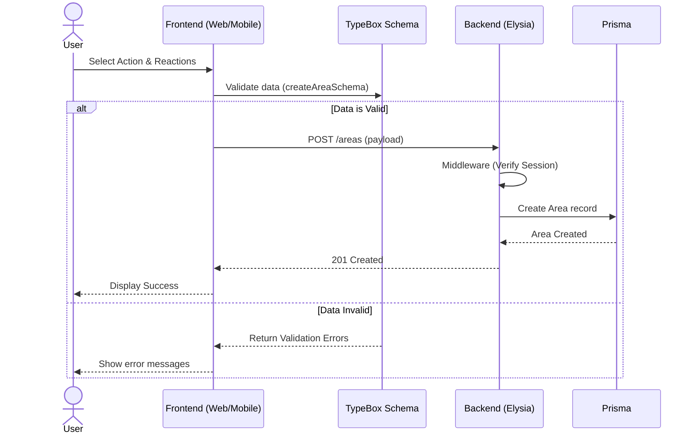

# Welcome to the AREA Project Technical Documentation

This site contains the complete technical documentation for the **AREA (Action-REAction)** project, an automation platform inspired by services such as IFTTT and Zapier.

## Project Goal

The objective is to allow users to connect different services (GitHub, Gmail, Spotify, etc.) by creating **AREA**s. Each AREA consists of:

- **An Action:** A trigger originating from a service (e.g., "A new Jira ticket is created" or "A new song is liked on Spotify").
- **A Reaction:** A consequence executed on another service (e.g., "Send a message on Discord").

## Global Architecture

The project is structured as a **monorepo** managed by **Bun Workspaces** and is divided into four main components:

1.  **Backend Server (`apps/backend`)**:
    - REST API developed with **ElysiaJS**.
    - Handles business logic, authentication, service connections, and the execution engine (Polling).
    - **PostgreSQL** database managed via **Prisma**.

2.  **Web Client (`apps/web`)**:
    - User interface developed with **SvelteKit** and **TailwindCSS**.
    - Features a visual flow editor (Node Editor) to create automations.

3.  **Mobile Client (`apps/mobile`)**:
    - Native application developed with **React Native (Expo)** and **NativeWind**.
    - Offers an interactive and animated creation assistant.

4.  **Shared Package (`packages/types`)**:
    - Contains shared TypeScript type definitions (DTOs, TypeBox Schemas) between the backend and clients to ensure data consistency.

## Class Diagram

## Sequence Diagram

## Sequence Diagram (OAuth)

## Area Creation Diagram

This documentation is divided into sections corresponding to each component to facilitate navigation and understanding.